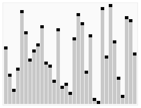

## Быстрая сортировка

>Быстрая сортировка относится к эффективным алгоритмам и состоит из нескольких шагов:

    Из массива выбирается опорный элемент, чаще всего посередине массива.
    Другие элементы массива распределяются таким образом, чтобы меньшие размещались до него, а большие — после.
    Далее первые шаги рекурсивно применяются к подмассивам, которые разделились опорным элементом на две части — слева и справа от него.

